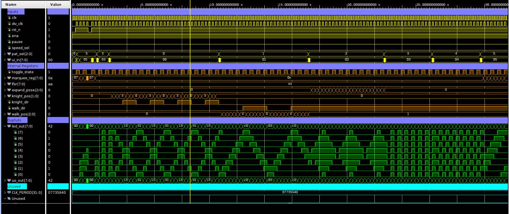
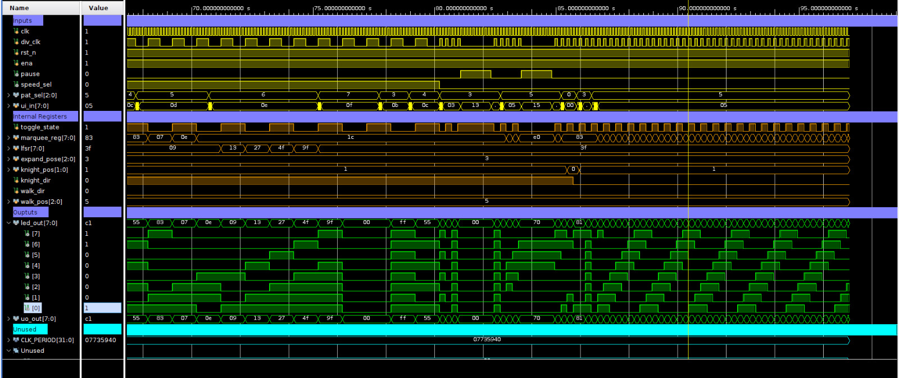
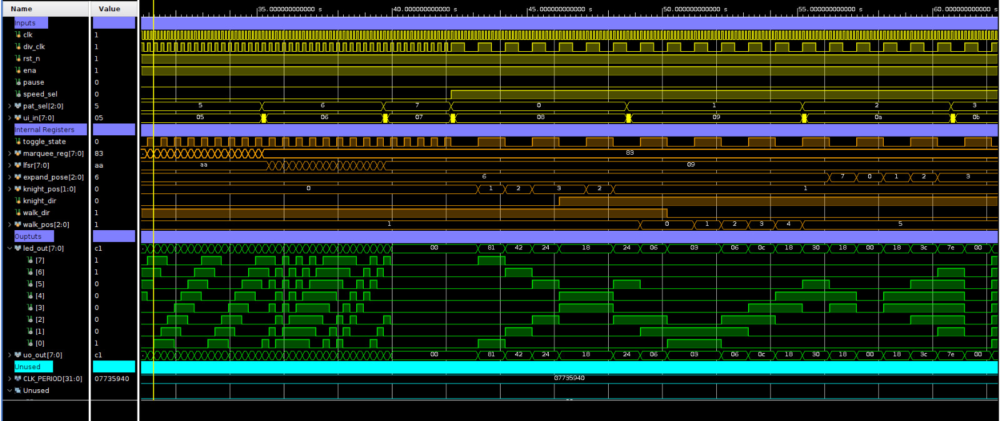
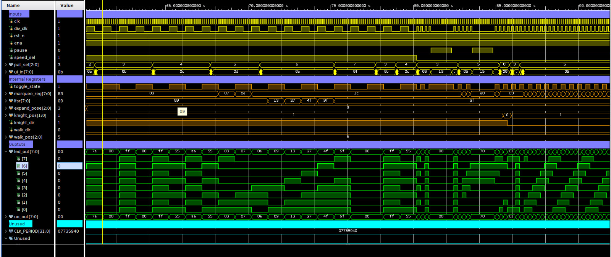

# Testing
This is a sample testbench for a Tiny Tapeout project. It uses [cocotb](https://docs.cocotb.org/en/stable/) to drive the DUT and check the outputs.
See below to get started or for more information, check the [website](https://tinytapeout.com/hdl/testing/).
## Setting up
1. Edit [Makefile](Makefile) and modify `PROJECT_SOURCES` to point to your Verilog files.
2. Edit [tb.v](tb.v) and replace `tt_um_example` with your module name.
## How to run
To run the RTL simulation:
```sh
make -B
```
To run gatelevel simulation, first harden your project and copy `../runs/wokwi/results/final/verilog/gl/{your_module_name}.v` to `gate_level_netlist.v`.
Then run:
```sh
make -B GATES=yes
```
## How to view the VCD file
Using GTKWave
```sh
gtkwave tb.vcd tb.gtkw
```
Using Surfer
```sh
surfer tb.vcd
```
---
## Project-Specific Information
This testbench is configured for the LED Pattern Generator project (tt_um_BMSCE_T2). The test suite provides comprehensive validation of all LED patterns and control features.
## File Structure
```
test/
├── requirements.txt # Python dependencies (pytest, cocotb)
├── Makefile # Build and simulation configuration
├── tb.v # Verilog testbench wrapper
├── tb.gtkw # GTKWave waveform viewer configuration
└── test.py # Main Python test suite
└── Waveforms # Snapshot of the test Waveforms
```
## Test Coverage
### LED Patterns Tested
The test suite validates all 8 LED patterns:
1. **Knight Rider** - Two LEDs converging at center then diverging to ends
2. **Walking Pair** - Two adjacent LEDs moving
3. **Expand/Contract** - LEDs expanding from center and contracting
4. **Blink All** - All LEDs blinking simultaneously
5. **Alternate** - Alternating LED pattern
6. **Marquee** - Rotating LED chase pattern
7. **Random Sparkle** - Random LED activation
8. **All Off** - All LEDs disabled

### Control Features Tested
- **Speed Control**: Fast (4Hz) and slow (1Hz) speeds
- **Pause Functionality**: Pattern freezing and resuming
- **Reset Behavior**: Proper reset to initial state
- **Enable Control**: ui_in[5] enable signal functionality
- **Pattern Switching**: Dynamic pattern changes
### Signal Mapping
- `ui_in[2:0]` - Pattern selection (3 bits = 8 patterns)
- `ui_in[3]` - Speed control (0=fast 4Hz, 1=slow 1Hz)
- `ui_in[4]` - Pause control (0=run, 1=pause)
- `ui_in[5]` - Enable signal for pattern changes
- `uo_out[7:0]` - 8-bit LED output

## Test Implementation Details
### LEDPatternTester Class
The main test class provides methods for:
- Testing individual patterns with configurable cycles
- Validating pause/resume functionality
- Checking reset behavior
- Testing enable signal control
- Pattern switching verification
### Test Functions
- `test_led_pattern_generator()` - Comprehensive test suite covering all patterns and features
- `test_basic_functionality()` - Simplified test for basic validation
### Timing Configuration
- Input Clock: 5MHz (200ns period)
- Pattern Update Clock: Internally divided to 4Hz fast mode and 1Hz slow mode
- Reset duration: 2 clock cycles
- Variable observation cycles based on pattern complexity
### Wave forms
Waveform 1

Waveform 2

Waveform 3

Waveform 4
