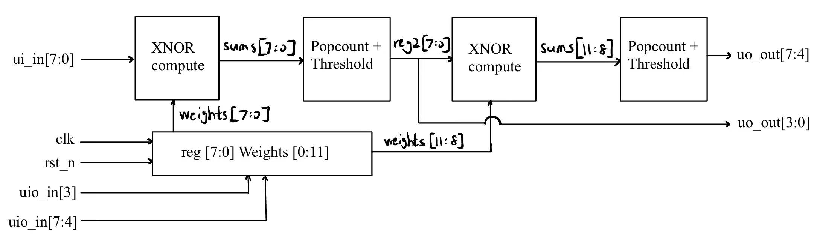
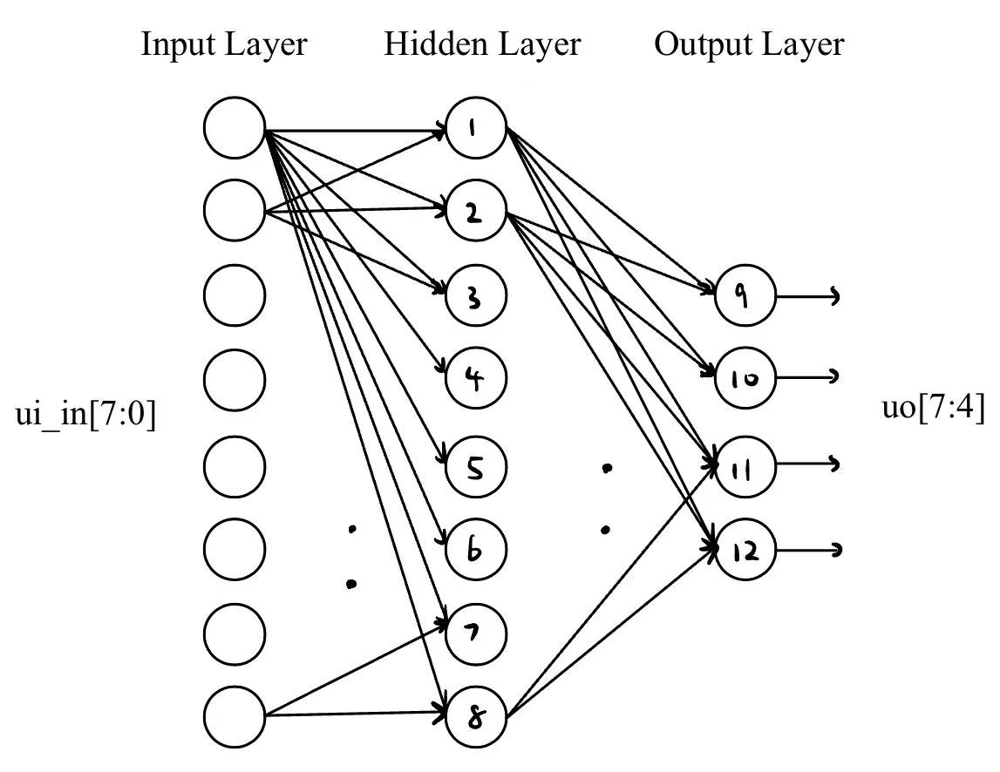

   

# BNN Project Documentation

### Design Objective

The objective of this project is to implement a 12-neuron Binary Neural Network (BNN) on a Tiny TapeOut ASIC platform. The network is designed to classify an 8-bit binary input, representing environmental or sensor-based signals, into one of four predefined movement categories: turn left, turn right, move forward, or stop.

The design is built to operate on the Tiny TapeOut platform, complying with its hardware and software limitations, while achieving the following goals.

- Efficient binary computation using XNOR + popcount + threshold logic
- Two-layer neural network: 8 neurons in the first layer and 4 in the second
- Serial weight-loading mechanism through shared I/O pins
- Integration with external training (Larq + TensorFlow) and verification via testbench

This design is intended to demonstrate how a compact binary neural network can be implemented with minimal hardware. Although weak right now, this design could operate at a much higher accuracy given sufficient hardware.

## 2. I/O Interface Specification (Lead: Vivi)

## 2.1 Input/Output Pin Description

The design uses 8 input pins and 8 output pins, representing sensor data and classification outputs. The bidirectional pins are used to load neuron weights during runtime.

### Inputs: `ui_in[7:0]` (8-bit sensor input)

These represent obstacle sensor readings from the front 180° field of view of the robot. Each bit corresponds to a directionally spaced sensor:

| Bit Index | Direction               | Description                          |
|-----------|-------------------------|--------------------------------------|
| `ui_in[0]` | Far left (−90°)         | Obstacle detection on far left       |
| `ui_in[1]` | Left-mid (−65°)         | Slightly left                        |
| `ui_in[2]` | Left-center (−40°)      | Between left and center              |
| `ui_in[3]` | Slight-left (−15°)      | Almost center, leaning left          |
| `ui_in[4]` | Slight-right (+15°)     | Almost center, leaning right         |
| `ui_in[5]` | Right-center (+40°)     | Between center and right             |
| `ui_in[6]` | Right-mid (+65°)        | Slightly right                       |
| `ui_in[7]` | Far right (+90°)        | Obstacle detection on far right      |

> These binary inputs are expected to be `0` when an obstacle is detected in that direction and `1` otherwise.

### Outputs: `uo_out[7:4]` (4-bit classification result)

The 4 most significant bits represent the output classification result from the BNN. Each bit corresponds to a possible movement command:

| Bit Index | Movement Command | Description                                                              |
|-----------|------------------|--------------------------------------------------------------------------|
| `uo_out[7]` | Turn Left         | Indicates the robot should turn left to avoid right-side obstacles       |
| `uo_out[6]` | Move Forward       | Path is clear, safe to proceed       |
| `uo_out[5]` | Turn Right     | Indicates the robot should turn right to avoid left-side obstacles                                   |
| `uo_out[4]` | Stop              | Indicates obstacles ahead; robot should stop                             |

> The BNN operates on **multi-action output**, meaning more than one of these bits can be high (`1`) at the same time.  
> For example:
> - If both `uo_out[7]` and `uo_out[4]` are high, the robot may **turn left**, but could also **stop** if needed.
> - If only `uo_out[5]` is high, it can proceed forward confidently.

The final action logic (e.g., priority or blending behavior) can be decided downstream by the robot's movement controller based on multiple active signals.

### Debug Outputs: `uo_out[3:0]`

These bits optionally reflect intermediate neuron activations (after layer 1, before layer 2) and are primarily used for simulation and testing purposes. 

### Bidirectional Pins: `uio[7:0]`

| Signal        | Description                                                   |
|---------------|---------------------------------------------------------------|
| `uio[7:4]`     | Serial 4-bit weight input (one nibble per clock cycle)        |
| `uio[3]`       | `load_enable` signal: held high to initiate weight loading    |
| `uio[2:0]`     | Reserved for future debug or extension                        |

### 2.2 Block Diagram

The following diagram illustrates the overall architecture of the BNN ASIC. It consists of:

- An 8-bit input bus (`ui_in[7:0]`) feeding into the first layer of 8 binary neurons.
- The first layer performs XNOR + popcount + threshold logic, generating intermediate binary outputs.
- These outputs are passed to a second layer of 4 neurons, which further classify the result.
- The final classification output is provided through `uo_out[7:4]`.
- Weight values are loaded serially into the neurons through `uio[7:4]`, controlled by `uio[3]` (`load_enable`).

A BNN neuron structure diagram can be found further down the documentation.

---

## 3. System Architecture and Hardware Specs (Lead: Vivi)
### 3.1 Architecture Description

The implemented Binary Neural Network (BNN) consists of a three-stage pipeline:

1. **Input Layer**: 8-bit binary vector from obstacle sensors  
2. **Hidden Layer**: 8 binary neurons, each connected to all 8 input bits  
3. **Output Layer**: 4 binary neurons, each connected to all 8 outputs from the hidden layer

Each neuron performs binary inference using XNOR, popcount, and threshold logic. This architecture is optimized for efficient ASIC implementation on the Tiny TapeOut platform.

#### Input Layer

- This layer is composed of 8 input lines: `ui_in[7:0]`
- Each bit corresponds to an obstacle sensor in a specific angular direction (−90° to +90° front field of view)
- The input bits are not processed in this stage — they are directly fed into all neurons in the hidden layer

#### Hidden Layer (8 Neurons)

- Each neuron in this layer receives the full 8-bit input vector
- **Operation**:
  - **XNOR**: Each input bit is XNOR'ed with a corresponding 8-bit weight
  - **Popcount**: The number of `1` bits in the XNOR result is counted
  - **Thresholding**: The result is compared against a fixed threshold value; if the popcount ≥ threshold, the neuron outputs `1`; otherwise `0`
- **Output**: This layer produces an 8-bit intermediate vector (1 bit per neuron)
- These outputs are latched and passed on to the output layer on the next clock edge

#### Output Layer (4 Neurons)

- Each output neuron receives all 8 bits from the hidden layer
- The same XNOR → Popcount → Thresholding sequence is applied

#### Neuron Logic Summary

Each neuron performs the following steps:

1. XNOR stage:
   For each bit `i = 0..7`, compute:
result[i] = input[i] XNOR weight[i]

2. Popcount stage:
Count the number of `1`s in `result[0..7]`

3. Threshold stage:
If popcount ≥ threshold:
neuron_output = 1

Else:
neuron_output = 0

This logic eliminates the need for multipliers or adders, enabling low-power binary computation.

---

### 4. Weight Loading Process (Lead: Evan)

The BNN supports dynamic runtime weight loading through the bidirectional pins `uio[7:4]`, enabling flexible reconfiguration of neuron weights without hardcoding.

- **Mechanism**:  
  Each neuron receives an 8-bit weight, loaded in two 4-bit chunks over two clock cycles via `uio[7:4]`. The first cycle loads the lower 4 bits, and the second cycle loads the upper 4 bits.

- **Sequence**:  
  Neurons are loaded sequentially from neuron 0 to neuron 15. Internally, a loading state counter tracks the current neuron being configured.

- **Control**:  
  The signal `load_enable` (connected to `uio[3]`) must be held high for the entire duration of the loading process. Since each neuron requires 2 cycles, a total of **32 clock cycles** are needed to load all 16 neurons. If `load_enable` goes low before completion, weight loading is aborted.

This protocol allows weights to be reloaded as needed while minimizing I/O usage and maintaining predictable timing. See the diagram below; note that some lines were omitted.

---
## 5. Training and Testing Plan (Lead: Evan)

### 5.1 Training Strategy

- **Framework**: Training is done using the [Larq](https://larq.dev) library, built on TensorFlow.
- **Dataset**: A total of 200 training samples are used, designed to reflect typical sensor input patterns and their associated motion decisions.
- **Rationale**:
  - Binary Neural Networks tend to overfit quickly, so smaller datasets are preferred for better generalization.
  - The dataset includes all four target categories (left, right, forward, stop), with slight input variations to improve robustness.

### 5.2 Weight Extraction and Formatting

- After training, binary weights are extracted neuron-by-neuron.
- Weights are arranged in 8-bit vectors per neuron, matching the expected format in the Verilog module.
- The exported weights are then serially injected into the design during simulation (and later, during actual chip runtime) via the bidirectional `uio[7:4]` interface.

### 5.3 Testbench and Verification (CocoTB)

Simulation-based testing is implemented using [CocoTB](https://www.cocotb.org/), allowing direct control of the DUT from Python. Two major test scenarios are implemented in `test.py`:

- **Test 1: Hardcoded Weights**
  - Validates default hardwired weights in the Verilog design. No weight loading is implemented in this stage.
  - Sensor input patterns are fed through `ui_in`, and the output `uo_out[7:4]` is checked for correct activation.
  - 14 test cases total, including 4 stop + 4 right + 4 forward + 2 left cases. Test cases are chosen manually based on suitability. 
    - i.e. `0b00001111` should always be classified as right-turn.
  - This test ensures correct XNOR + popcount + threshold functionality with pre-defined & trained weights.

- **Test 2: Dynamic Weight Loading**
  - Dynamically loads neuron weights using `uio[7:4]` and `load_enable`.
  - After loading, a test input of `0b11110000` is applied and the output is verified.
  - This test checks both the correctness of the serial weight loading protocol and the inference result with user-supplied weights.

### 5.4 Evaluation and Results

- **Test Set**: 14 distinct input patterns are tested. Covers all 4 potential operations (stop, right, forward, left)
- **Metrics**:
  - Classification correctness (match expected output bits)
  - Signal timing correctness (e.g., output should stabilizes after 3 cycles)
  - Weight loading latency (verified to complete in 32 cycles)

> All 14 of our 14 test cases pass with expected output behavior. The design meets functional correctness goals. Note that further testing does reveal wrong testcases. It's clear that more improvements could be made given a larger and deeper BNN.

---

## 7. Team Roles and Responsibilities

| Member      | Responsibilities                                        |
|-------------|---------------------------------------------------------|
| Vivi Huang  | I/O specification, block diagrams, hardware estimation |
| Evan Zhang  | Training data, testing, Python integration              |

---

## 8. Project Timeline Log

| Date        | Milestone / Work Completed                                   |
|-------------|--------------------------------------------------------------|
| May 17, 2025 | Finalized project theme and goal                            |
| May 26, 2025 | Project officially started, drafted first documentation and ideas                                   |
| June 2, 2025 | Drafted the architecture block diagram for the BNN                      |
| June 8, 2025 | Defined I/O interface, hardware specs, and testing methods, written in documentations  |
| June 10–23, 2025  | Iteratively refined Verilog logic, weight-loading control. Went backwards and modified structural designs to comply with hardware limits and Verilog restrictions.   |
| June 24, 2025 | Finalized block diagram including neuron calculations and serial weight-loading. Debugged errors in Verilog codes        |
| July 1–10, 2025    | Began testing based on Python and Cocotb, ran functional sims, debugged final linter errors and synthesis errors    |
| July 17, 2025 | Training and testing scripts finalized, verified accuracy, resolved linter errors |
| July 27, 2025 | Passed all GDS tests and own timing analysis through tools like OpenSTA, ready for next steps|
| | ** Note that the repository still poses a synthesis warning on data storage with FFs. This is safe in a small BNN as the weights array don't create an overwhelming amount of FFs.|
---

