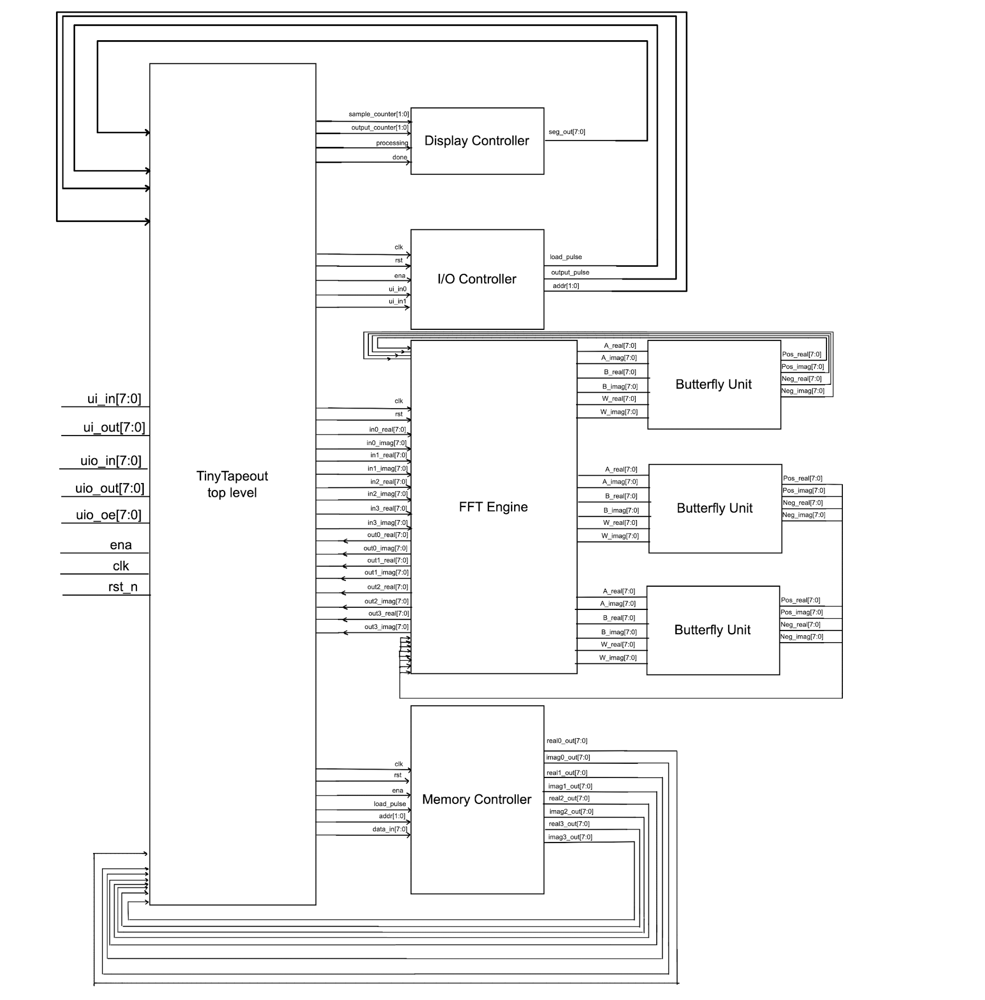

   

# 4-Point FFT Engine for 8-bit Samples

This project implements a 4-point, 8-bit fixed-point Fast Fourier Transform (FFT) engine using SystemVerilog, designed to be deployed on TinyTapeout through the TT PCB. The FFT engine is based on a radix-2 decimation-in-time (DIT) architecture, structured in two stages using butterfly modules and twiddle factor multiplication to compute the frequency-domain representation of four complex time-domain samples.

The system interfaces with users through a simple control scheme consisting of 8 input switches, bidirectional I/O pins, and a single-digit 7-segment display. Switches 0 and 1 control the data flow into and out of the system, respectively.

## Project Overview

- **Authors**: Mariam ElSahhar, Hadi Zaidi
- **Architecture**: 4-point FFT using radix-2 decimation-in-time with butterfly units
- **Input/Output**: 8-bit complex samples (full 8-bit real and imaginary components)
- **Clock**: 50 MHz
- **Processing Time**: 20 clock cycles

## Pin Configuration

### Dedicated Input Pins `ui_in[7:0]`
Used to interface with control switches

### Dedicated Output Pins `uo_out[7:0]`
Used to interface with 7-segment display

### Bidirectional GPIO Pins
- **Input Mode `uio_in[7:0]`**: Used to input samples
- **Output Mode `uio_out[7:0]`**: Used to output frequency bins  
- **Output Enable `uio_oe[7:0]`**: Indicates whether pins are inputting/outputting

### Control Signals
- **Reset `rst_n`**: Active low reset
- **Clock `clk`**: System timing (50 MHz)

## System Architecture



## Operation

1. **Load Phase**: Input 4 complex samples sequentially via data bus
2. **Processing**: FFT computation (20 cycles)
3. **Output Phase**: Read 4 complex FFT results sequentially

The 7-segment display shows the current operation mode throughout the process.

## Documentation

- [Technical Documentation](docs/info.md) - Detailed architecture and operation
- [Test Plan](docs/testplan.md) - Pre-silicon testing strategy
- [INITIAL Google Doc, outdated now only kept to show initial arch/diagrams](https://docs.google.com/document/d/13jseVi1bMsw91EZKD1t0jHazFGBT2K84RPKfIGI_DeA/edit?tab=t.0#heading=h.6vw8kxunlpo9)


## How to Test

See the [test directory README](test/README.md) for detailed instructions on running pre-silicon tests.

### Available Test Targets
```bash
cd test

# Run individual module tests
make test-butterfly     # Test butterfly computation units
make test-fft-engine   # Test core FFT engine
make test-memory       # Test memory controller
make test-io           # Test I/O controller
make test-top          # Test complete system

# Run all tests
make all

# Gate-level simulation (after synthesis)
make test-top GATES=yes
```

### Quick Start

#### 1. Set up Python Environment
```bash
# Create a virtual environment
python3 -m venv fft_test_env

#Activate the virtual environment

# Install required packages
cd test
pip install -r requirements.txt
```

#### 2. Run Tests
```bash
# Run full system test
make test-top

# Or run all tests
make all
```

#### 3. Deactivate Environment (when done)
```bash
deactivate
```


