 

# CMOS ASIC for Simultaneous Electrode-Skin Impedance Measurement 

- [Read the documentation for project](docs/info.md)

## What are Motion Artifacts?

unwanted, nonstationary distortions that contaminate bio-signals due to movement of the subject or electrodes during recording

## Remove motion artifacts using impedance measurement 

There are various methods to remove motion artifacts. In this project, we expect to use adaptive filtering techniques, providing the skin–electrode impedance signal as a reference to filter out motion artifacts.

## Impedance mesuremnt ASIC

In this project, we will design and tape out an application-specific integrated circuit (ASIC) to obtain the in-phase and quadrature (I/Q) components of the skin–electrode impedance signal, stimulated by a body signal, while using the EEG signal as the input. The ASIC consists of four fully differential operational amplifiers for implementing an active RC band-pass filter, along with four fully differential multipliers and an oscillator that generates a 1.2 kHz sinusoidal body stimulus signal.

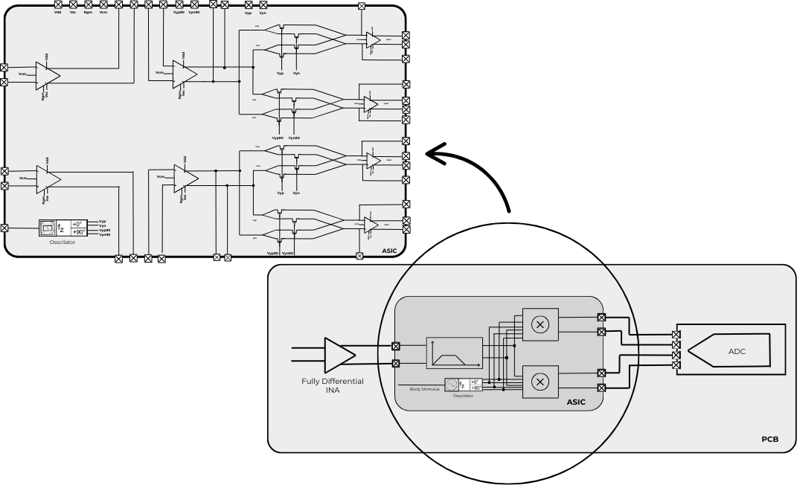

## Project Phases  

### Phase 01 – Design and Tapeout of a Fully Differential Operational Amplifier  
In the first phase of the project, we will design a **fully differential operational amplifier (op-amp)**.  
This op-amp will serve as a fundamental building block that can be reused across all modules of the ASIC.  
The design and simulations will be carried out using the **Sky130 PDK**.  

### Phase 02 – Design and Layout of the ASIC for Impedance Measurement  
In the second phase, we will design the complete ASIC for **impedance measurement**.  
The chip will integrate:  
- Four fully differential op-amps  
- Four fully differential multipliers  
- An oscillator to generate the stimulus signal  

The design and layout will be implemented using the **IHP PDK**.  

#### Phase 01 – Design and Implementation of Fully Differential Operational Amplifier  

##### Specifications  

| Parameter                               | Value 1 | Value 2 | Value 3 |
|-----------------------------------------|---------|---------|---------|
| **Supply Voltage (Design Input)**       | 1.7 V   | 1.8 V   | 1.9 V   |
| **Common Mode Voltage (Design Input)**  | 0.85 V  | 0.9 V   | 0.95 V  |
| **Common Mode Voltage (Design Output)** | 0.85 V  | 0.9 V   | 0.95 V  |
| **Temperature (Design Input)**          | 20 °C   | –       | 50 °C   |
| **PSRR**                                | 170 dB  | 180 dB  | 190 dB  |
| **CMRR**                                | 230 dB  | 250 dB  | 270 dB  |
| **Phase Margin**                        | 50°     | 60°     | 70°     |
| **Gain Bandwidth Product**              | 800 kHz | 1 MHz   | 1.2 MHz |
| **Open Loop (low-freq) DC Gain**        | 80 dB   | 100 dB  | 120 dB  |

#### Project Architecture  

We expect to design a **two-stage operational amplifier** with a **common-source stage** as second stage for gain enhancement.  
For each stage, a **common-mode feedback (CMFB) circuit** is used to ensure stability and maintain the desired common-mode voltage throughout the design.  

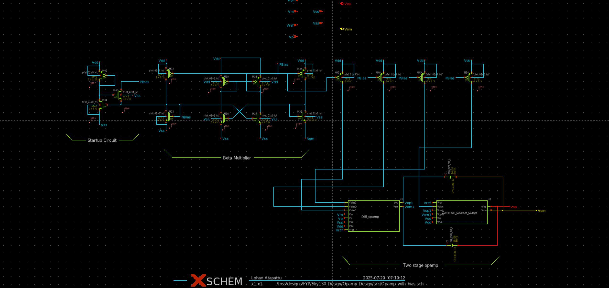

##### Biasing Circuit  

We have employed a **beta-multiplier based biasing circuit** design with a **startup circuit**, as shown below:  

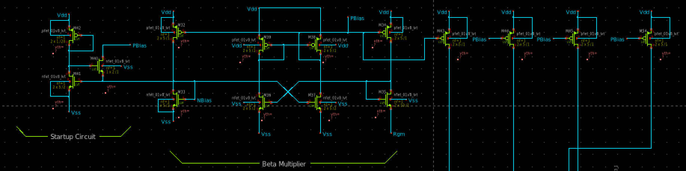

##### Operational Amplifier  

For the operational amplifier stage, we have employed a **folded cascode architecture**.  
Additionally, a **single-ended differential amplifier based common-mode feedback (CMFB) circuit** is used to maintain the common-mode voltage at a fixed reference level.  

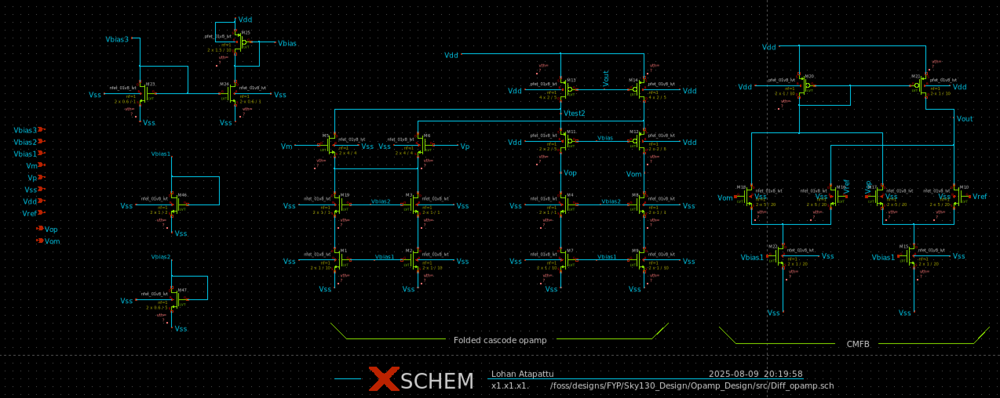

##### Common Source Stage  

For the common source stage, we have used a **resistor-based common-mode feedback (CMFB) topology** to stabilize the output common-mode voltage.  

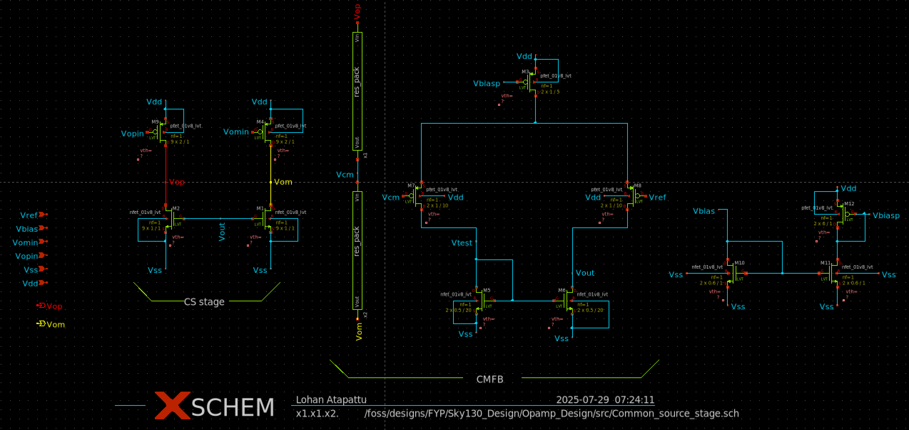

#### Simulations  

For the simulations, we have used the following testbench setup:  

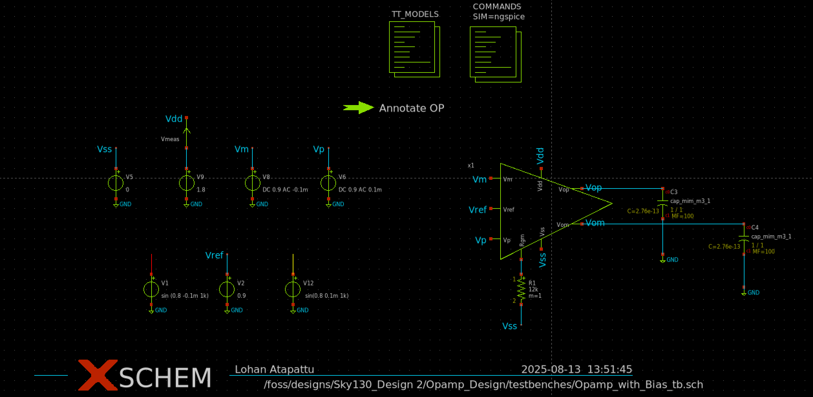

##### Gain Bandwidth Product  
 

The **gain bandwidth product (GBW)** of our design is shown below.  
In this simulation, the design also achieves a **65° phase margin**, ensuring stability.  

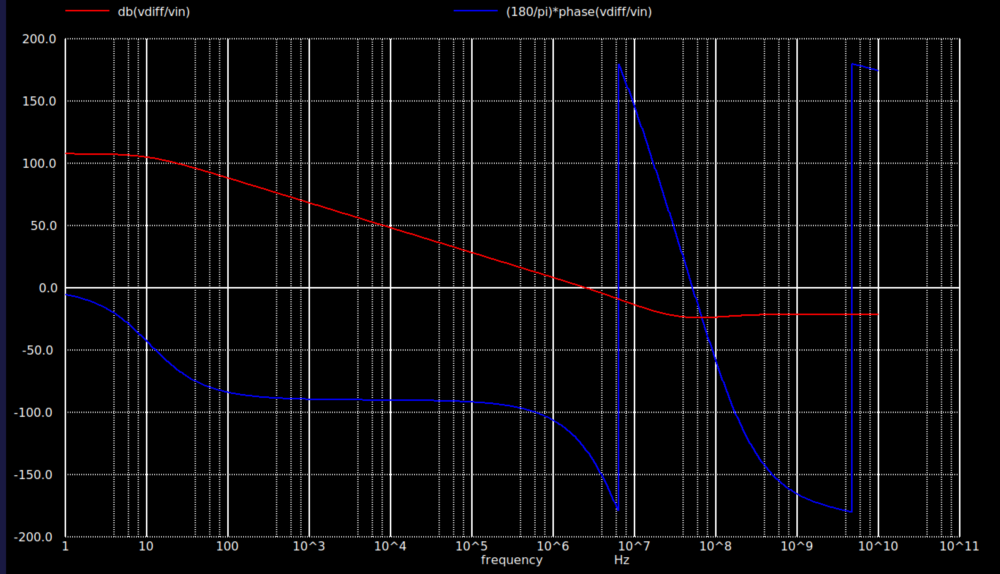

##### CMRR  

We have achieved a **high Common-Mode Rejection Ratio (CMRR)** in our circuit, primarily due to its **fully differential architecture**.  
This enhances noise immunity and improves the overall signal integrity.  

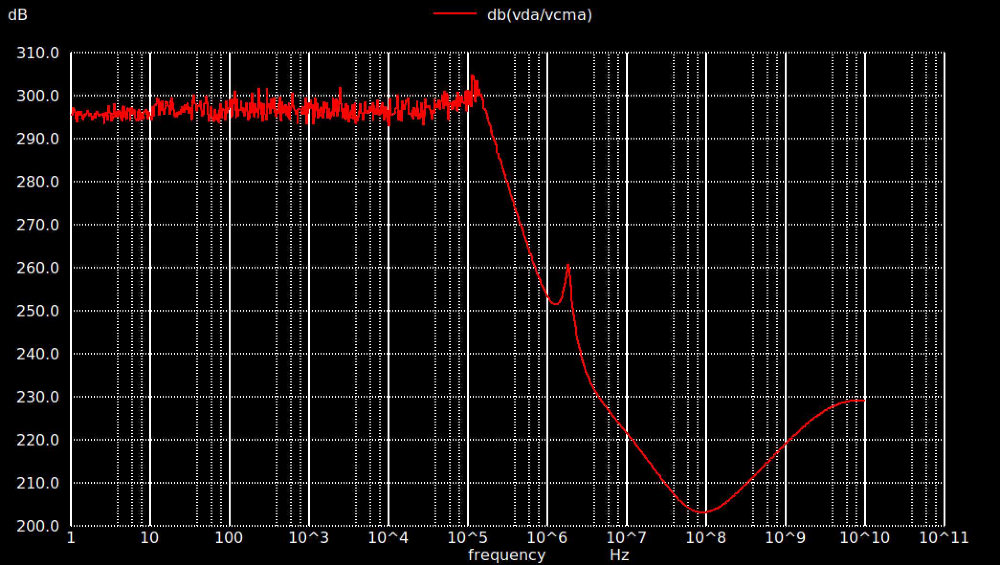

##### PSRR Test Results  

Below are the test results obtained for the **Power Supply Rejection Ratio (PSRR):**  

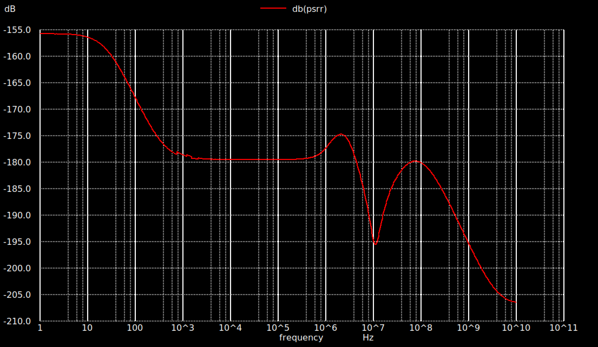

#### Phase 02 – Design and Layout of the ASIC for Impedance Measurement  

##### Specifications  

| Specification                          | Min   | Typ   | Max   | Unit | Comments |
|----------------------------------------|-------|-------|-------|------|----------|
| **Overall Design**                     |       |       |       |      |          |
| Supply voltage (Design Input)          | 1.7 V | 1.8 V | 1.9 V |      |          |
| Common mode voltage (Design Input)     | 0.85 V| 0.9 V | 0.95 V|      |          |
| Common mode voltage (Design Output)    | 0.85 V| 0.9 V | 0.95 V|      |          |
| Temperature (Design Input)             | 20 °C |       | 50 °C |      |          |
| **Fully Differential Operational Amplifier** |   |       |       |      |          |
| PSRR                                   | 170 dB| 180 dB| 190 dB|      |          |
| CMRR                                   | 230 dB| 250 dB| 270 dB|      |          |
| Phase margin                           | 50°   | 60°   | 70°   |      |          |
| Gain bandwidth product                 | 800 kHz| 1 MHz| 1.2 MHz|     |          |
| Open loop (low-freq) DC gain           | 80 dB | 100 dB| 120 dB|      |          |
| Common mode voltage (Design Input)     | 0.85 V| 0.9 V | 0.95 V|      |          |
| **Multiplier**                         |       |       |       |      |          |
| Linear range                           | 50 mV |       | 200 mV|      |          |
| Common mode voltage (Design Input)     | 0.85 V| 0.9 V | 0.95 V|      |          |
| **Oscillator**                         |       |       |       |      |          |
| Frequency                              | 1 kHz | 1.2 kHz| 1.5 kHz|   |          |

##### Fully Differential Amplifier  

The fully differential amplifier design is the same as described above.  

##### Fully Differential Multiplier  

For the **fully differential multiplier** design, we have employed a **fully differential operational amplifier-based topology**, as shown below:  

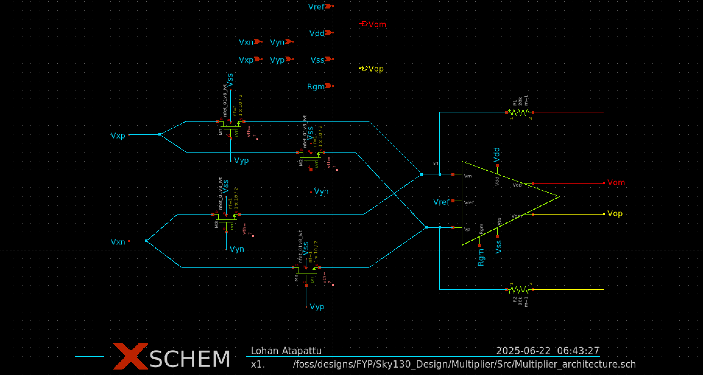

##### Simulations  

###### Linearity  

The **linearity** of the circuit was tested, and the results are shown below:  

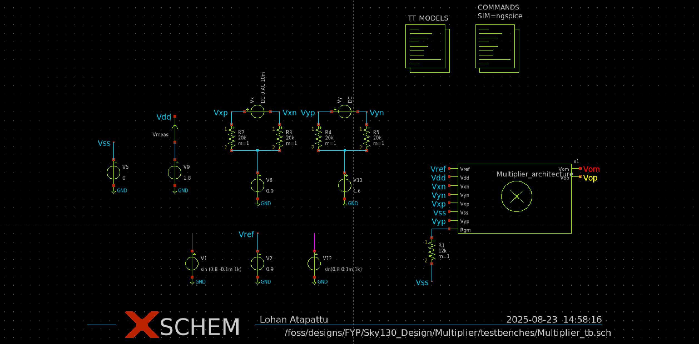

Above is the linearity testbench for the multiplier

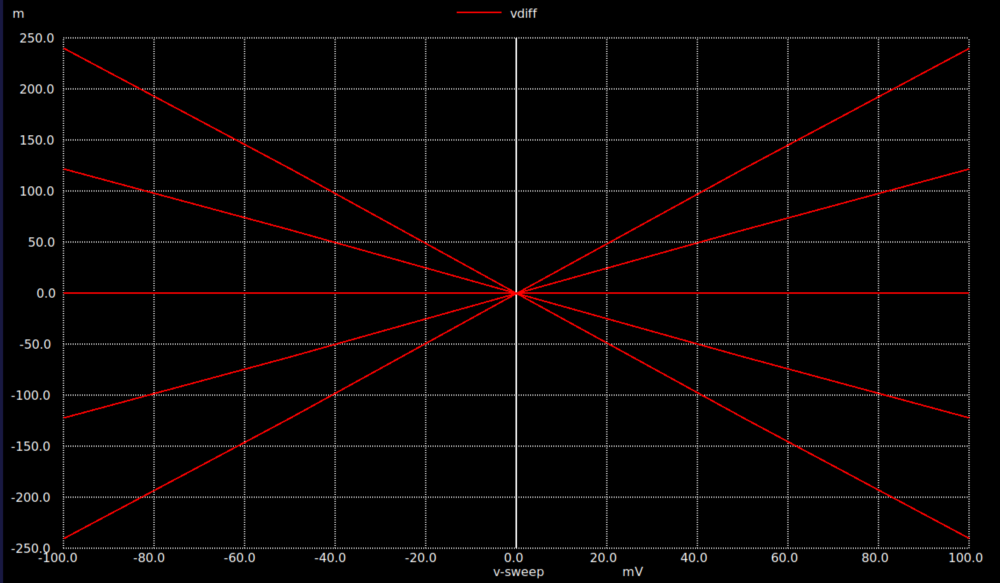

##### Fully Differential Bandpass Filter  

We implemented a **multiple-feedback topology 2nd-order Butterworth bandpass filter**.  

###### Testbench  
The testbench setup for the filter is shown below:  

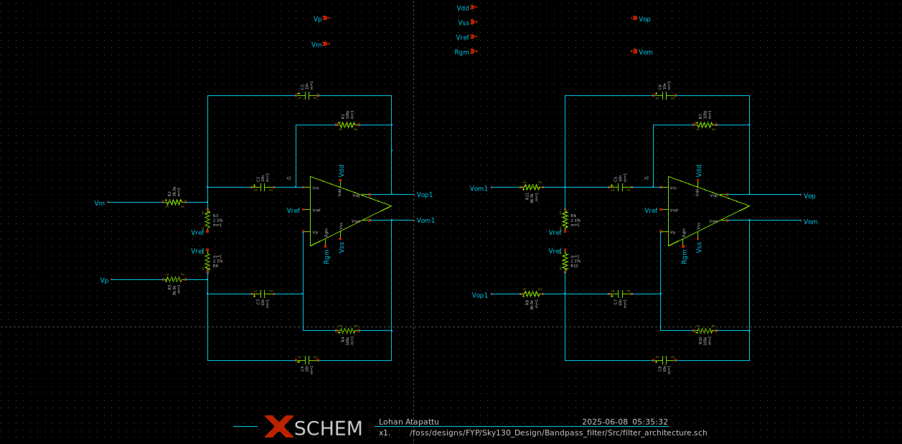  

###### Test Results  
The testing results for the bandpass filter are shown below:  

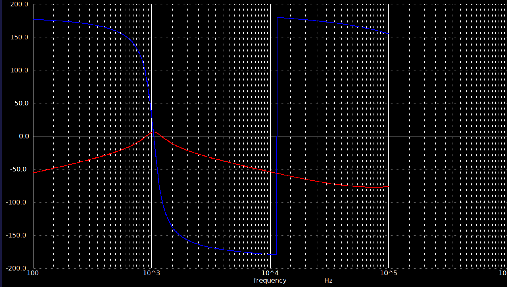  

