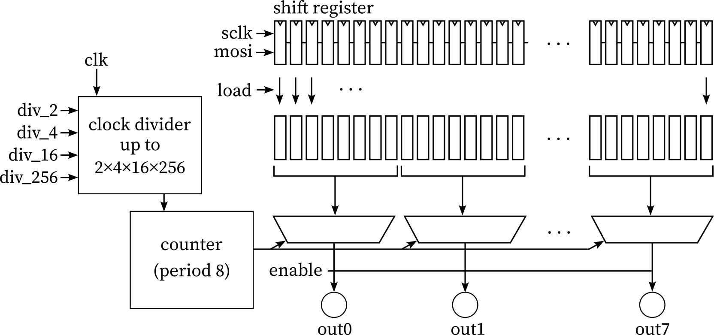

   

# Arbitrary Waveform Generator for Tiny Tapeout

A project for the [Tiny Tapeout](https://tinytapeout.com/) SKY25a shuttle.

This is a simple arbitary waveform generator that loads and streams data to digital outputs at a configurable frequency. To produce a complete waveform, analog circuitry must be connected to the outputs to implement an R-2R DAC, thermometer-coded DAC, or similar.

[Read the documentation here](docs/info.md)

## How it works

This projects implements a simple streaming arbitrary waveform generator. There are 8 digital output pins which need to be connected to an external R-2R ladder or similar in order to produce an analog waveform. These pins are cycled between 8 states, creating an arbitrary wave.

The data is provided by an external microcontroller via SPI (`sclk` and `mosi`, though `sclk` must be at least 2x slower than `clk`) into a shift register. The shift register data is loaded into an active register from which the wave is generated when `load` is high. Note this allows changing data when streaming. Output can be turned on or off with `enable`.

The output frequency is `clk` modulo the period 8 output counter, but there are four clock dividers available to slow the output waveform. These are 2x, 4x, 16x, and 256, stackable for up to 32768x division, not including the 8x division of the waveform.

## How to test

Ensure `rst_n` is high and begin by constantly toggling `clk` at a sufficiently high value (this is required for SPI to work). Next, use `sclk` and `mosi` to feed in waveform data equal to the number of time points (8) times the number of output pins (8), i.e., 64 bits total. Once data is loaded, raise the `load` pin to make the data active, and hold `enable` high to start output. The provided data should now be shown sequentially on output pins. Optionally hold frequency pins high to divide the clock signal.

## External hardware

By itself, this circuit merely toggles its output pins. To create a single analog waveform, some sort of DAC circuitry needs to be attached to the output: an R-2R ladder, a monotonic string / thermometer-coded DAC, or similar.

