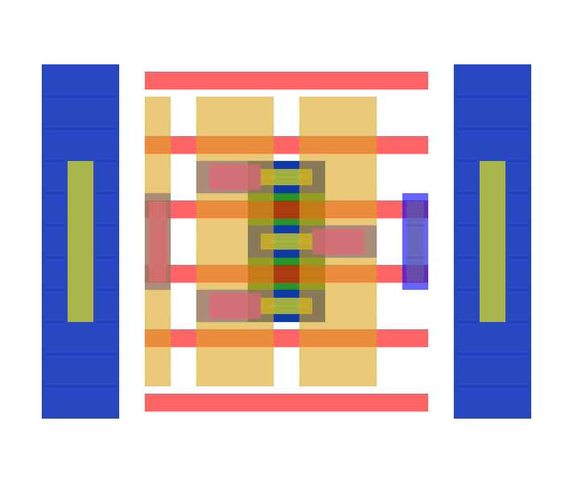
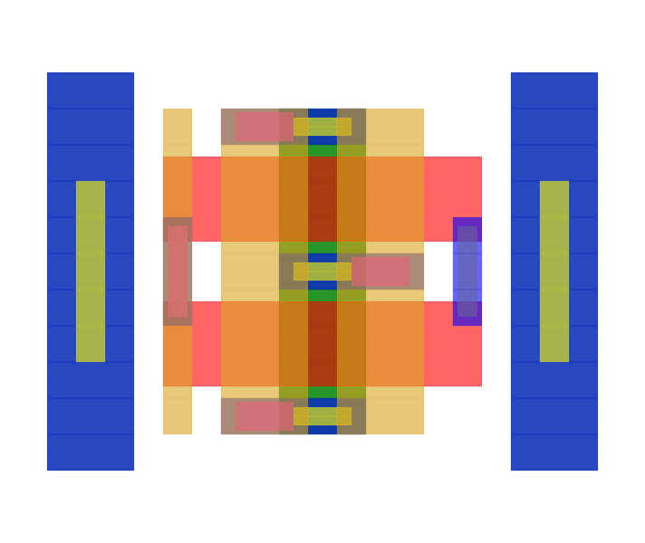

A standard transistor library

The naming convention is NCH/PCH for NMOS and PMOS.

The width is set by the number of contacts (2C)

The length is a multiplum of minimum (1F2)

A transistor called PCH_2C1F2 is a PMOS with 2 contacts on drain/source
and a 1.2x minimum gate length.

While a transistor called "PCH_2C5F0" is a PMOS with 2 contacts and 5x minimum
gate length.

