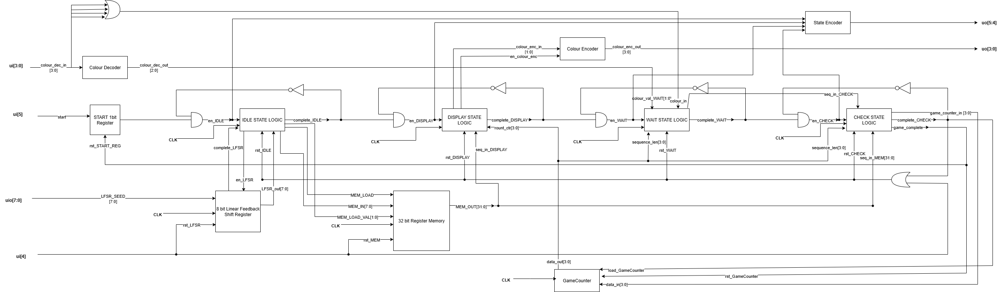
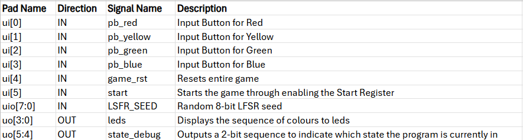
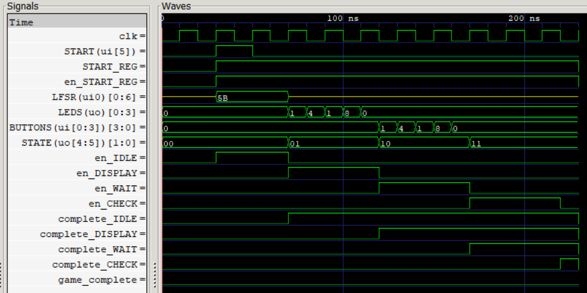

## How it works

This project implements the classic _Simon Says_ game. The design uses digital logic to control game flow and memory elements to store a pseudo-random sequence of colors. The system interfaces with external buttons and LEDs to allow human interaction and gameplay.

### Game Flow

Upon powering up the chip:

1. **Idle State**

   - Waits for the `start` signal.
   - A 8-bit seed is loaded into the LFSR via the bidirectional bus.
   - A 32-bit pseudo-random sequence is generated by the LFSR.
   - Each color is encoded in 2 bits, allowing 14 colours (16 × 2 bits = 32 bits - 4 bits (for start and end)).
   - The sequence is stored in a 32-bit register-based memory.

2. **Display State**

   - Displays the desired colour sequence on the LEDs.

3. **Wait State**

   - Waits for user inputs through button presses and stores the respective 14-colour sequence.

4. **Check State**

   - Verifies the user inputs against the stored colour sequence.
   - If correct, the game ends and is considered to be won. The game_complete signal will be 1, indicating a win.
   - If incorrect, the game ends and is considered to be lost. The game_complete signal will be 0, indicating a loss.
   - Note: Based on the design even if the user enters an incorrect colour early on, the user must enter enough colours for that sequence before the mistake is detected. For example, if the second colour entry is incorrect, the user will still need to enter the rest of the colours in the 14-colour sequence.

5. **End of Game**
   - Triggered when the player enters their sequence and is checked by the check_state block. The user can press the reset button to begin a new round of Simon Says.

### Key Components

1.  **32-bit Register Memory**

- Stores the color sequence (14 values × 2 bits + 4 bits for start and end).

2. **8-bit Linear Feedback Shift Register (LFSR)**

   - Generates a pseudo-random 32-bit sequence.
   - Uses a 8th-order primitive polynomial to ensure maximal length (2^8 - 1 = 255 values).
   - Special logic ensures the state never becomes all zeros.
   - Seeded externally to vary game sequences across resets and sessions.

3. **Color Encoder/Decoder**

   - Converts 4 individual button signals into a single 2-bit color value for logic comparison (and vice versa).
   - Ensures consistent color encoding across modules.

4. **Game States**
   - Contains the logic to execute each state of the game.
5. **State Debug**

   - Current game state -- represented as a 2 bit value -- is assert on 2 output ports as a means to debug.
     uo_out[5]uo_out[4]

   IDLE: 00
   DISPLAY: 01
   WAIT: 10
   CHECK: 11

### Block Diagram

### I/O Table

### Timing Diagram

Below shows the expected timing diagram for one round of the game. It transitions between the IDLE, DISPLAY, WAIT, and CHECK states.
 
Note, much of the timing relies on user input so the displayed state durations may not match the lengths during gameplay. A random LFSR Seed of 0x5B is loaded along with a current display sequence of 1, 4, 1, 8 or (0b0001, 0b0100, 0b0001, 0b1000).

## How to test

### Gameplay Functionality

- Simulate a full round win by entering the correct sequence.
- Simulate a mistake during the round. Game should detect incorrect input in `CHECK` and set the game_complete signal to 0, indicating a loss.

### Game State Transitions

- Verify transitions using state debug signal:
  - `IDLE → DISPLAY → WAIT → CHECK
- Confirm each state's role:
  - `DISPLAY`: Colour is displayed long enough for user to understand and colour sequence is consistent between rounds.
  - `WAIT`: State ends only when all required colours are entered. (ex. in the 14-colour sequence, must wait until 14 colours are entered).
  - `CHECK`: Correct validation. (if the user enters a correct sequence, it should end the game and set game_complete to 1, indicating a win.

### Startup & Seeding

- On power-up, game should remain in `IDLE` until Start is pressed. Verify using State debug signal.
- Provide an 8-bit seed and press Start — game should transition to `DISPLAY`. Verify using State debug signal.
- Using the same seed should yield the same sequence. Different seeds should generate different sequences (LFSR test).

### Reset Behavior

- Press reset in any state — game should return to `IDLE`, discarding current game state.
  - Test reset: before `IDLE`, during `IDLE`, `DISPLAY`, `WAIT`, `CHECK`

### External hardware

| Component    | Quantity | Notes                                                                |
| ------------ | -------- | -------------------------------------------------------------------- |
| Push Buttons | 6        | Red, Blue, Green, Yellow, Start, Reset                               |
| LEDs         | 4        | One for each color, with pull-down resistors                         |
| Raspberry Pi | 1        | Sends 8-bit seed to the chip and reads in a 2-bit State Debug Signal |
